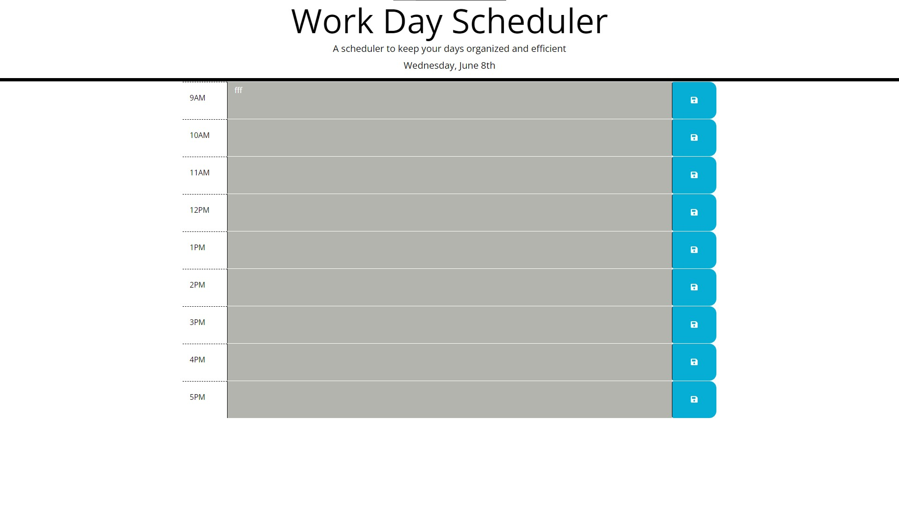

# Work-Scheduler

# Work Day Scheduler

## Purpose of application
This application helps the user stay organized by saving events for each hour of the day. The application will run in the browser and feature updated HTML and CSS and is powered by jQuery.Code.

## Description
A calendar application that allows the user to save events for each hour of a working day. The current date of the user will be displayed under the title. There are time blocks for each hour of a working day, 9am - 5pm. Each row will have a section to type text for the events that they may have. The time blocks are color-coded for past, present or future. The page will also automatically refresh every 15 minutes to change color coding based on time. 

## User Story
AS AN employee with a busy schedule
I WANT to add important events to a daily planner
SO THAT I can manage my time effectively

## Acceptance Criteria
GIVEN I am using a daily planner to create a schedule
WHEN I open the planner
THEN the current day is displayed at the top of the calendar
WHEN I scroll down
THEN I am presented with time blocks for standard business hours
WHEN I view the time blocks for that day
THEN each time block is color-coded to indicate whether it is in the past, present, or future
WHEN I click into a time block
THEN I can enter an event
WHEN I click the save button for that time block
THEN the text for that event is saved in local storage
WHEN I refresh the page
THEN the saved events persist

## Mock-Up
The following animation demonstrates the application functionality:

    

## Built With
* HTML
* CSS
* JavaScript
* Jquery
* Bootstrap
* moment.js library for Date and Time

## Website

https://hjchoi365.github.io/Work-Scheduler/